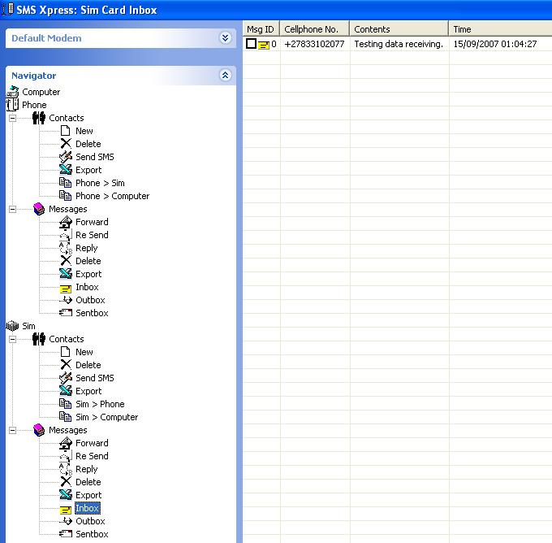



## SMS Xpress Version 1\.0\.0

### Description

Access sim card/phone to read, delete, copy, export phonebook entries and sms messages and also send a sms to the limit of 320 characters to another cellphone user. Read the signal strength of the cellphone/modem. The readmefirst.txt has a detailed explaination of what the gsm.ocx does in detail. You connect to a modem via a comm port and most of the operations are via AT commands. A timer is used to get the result of the modem and results are returned via same function eg. gsm.PhoneBook_ListView will list your sim card/cellphone phonebook entries to the named listview and PhoneBook_Export will export your sim card / phone phone book entries to a csv file. Experience it for yourself and please dont forget to vote. This code does not use a compiled ocx but the GSM.ocx has been developed purely for handling almost everything about communication with the sim card / phone.
 
### More Info
 

             |
---                |---
**Submitted On**   |2007-09-15 11:34:42
**By**             |[Anele Mbanga](https://github.com/Planet-Source-Code/PSCIndex/blob/master/ByAuthor/anele-mbanga.md)
**Level**          |Advanced
**User Rating**    |4.8 (43 globes from 9 users)
**Compatibility**  |VB 6\.0
**Category**       |[Complete Applications](https://github.com/Planet-Source-Code/PSCIndex/blob/master/ByCategory/complete-applications__1-27.md)
**World**          |[Visual Basic](https://github.com/Planet-Source-Code/PSCIndex/blob/master/ByWorld/visual-basic.md)
**Archive File**   |[SMS\_Xpress2083459152007\.zip](https://github.com/Planet-Source-Code/anele-mbanga-sms-xpress-version-1-0-0__1-69333/archive/master.zip)

